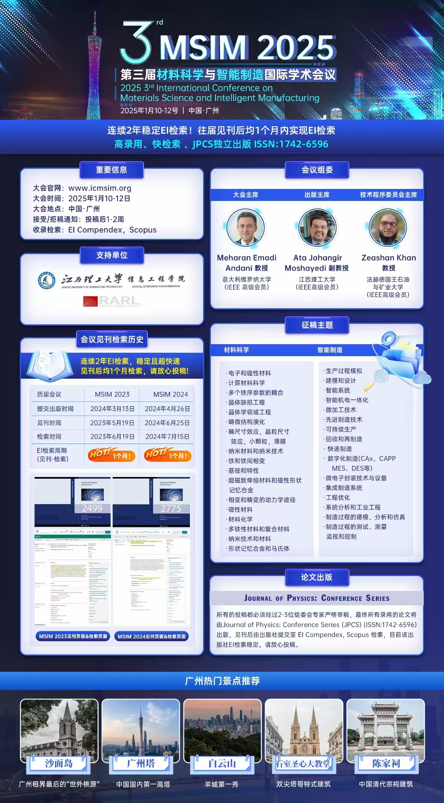

The 3rd International Conference on Materials Science and Intelligent Manufacturing (MSIM 2025) will be held from **January 10-12, 2025**, in **Guangzhou, China**. This conference promises to be a landmark event, bringing together researchers and practitioners to discuss the latest advancements in the fields of materials science and intelligent manufacturing. The conference has seen **two years of stable EI indexing** and continues to offer high acceptance rates and quick indexing of proceedings.

### Key Information

- **Conference Date**: January 10-12, 2025
- **Location**: Guangzhou, China
- **Official Website**: [www.icmsim.org](http://www.icmsim.org)
- **Submission Notification**: Acceptance/Rejection notices will be sent 1-2 weeks after submission.
- **Indexing**: EI Compendex, Scopus
- **ISSN**: 1742-6596 (Journal of Physics: Conference Series)
  
### Supported by
- Jiangxi University of Science and Technology, School of Information Engineering
- RARL (Research and Application of Robotic Labs)

### Recent Conference Publication History

This conference is renowned for its quick publication cycle:
- **MSIM 2023**: Published on March 13, 2024, and indexed by EI on May 19, 2024.
- **MSIM 2024**: Published on April 26, 2024, and indexed by EI on June 25, 2024.

Both events saw stable indexing within a month of publication.

### Call for Papers: Topics of Interest

The conference invites high-quality submissions in the following areas:

#### Materials Science
- **Electronic and Magnetic Materials**
- **Computational Materials Science**
- **Crystal Defect Engineering**
- **Nanomaterials and Nanotechnology**
- **Shape Memory Alloys and Magnetic Shape Memory Alloys**
- **Multiferroic Materials and Composites**
  
#### Intelligent Manufacturing
- **Smart Manufacturing Systems**
- **Micro-manufacturing Techniques**
- **Sustainable Production and Recycling**
- **Advanced Manufacturing Technologies**
- **Smart Mechatronics and Embedded Systems**
- **Simulation and Modeling of Manufacturing Processes**

### Publication and Indexing

All accepted papers will be peer-reviewed by 2-3 experts and published in **Journal of Physics: Conference Series (JPCS)** (ISSN: 1742-6596). After publication, the proceedings will be submitted for indexing by **EI Compendex** and **Scopus**.

### Conference Chairs and Organizing Committee
- **Conference Chair**: Professor Meharan Emadi, University of Verona, Italy (IEEE Senior Member)
- **Publication Chair**: Associate Professor Ata Jahangir Moshayedi, Jiangxi University of Science and Technology (IEEE Senior Member)
- **Technical Program Chair**: Professor Zeashan Khan, King Fahd University of Petroleum & Minerals, Saudi Arabia (IEEE Senior Member)

### Guangzhou Attractions

If you're planning to attend MSIM 2025, don't miss out on the city's top attractions:
- **Shamian Island**: Known as the "last foreign enclave."
- **Canton Tower**: The tallest structure in China.
- **Baiyun Mountain**: Known as the "First Beauty of Guangzhou."
- **Sacred Heart Cathedral**: A stunning Gothic architectural masterpiece.
- **Chen Clan Ancestral Hall**: A famous example of Qing Dynasty architecture.

---

For more details, please visit the official conference website or [submit your paper here](http://www.icmsim.org). We look forward to your participation in this prestigious event!
