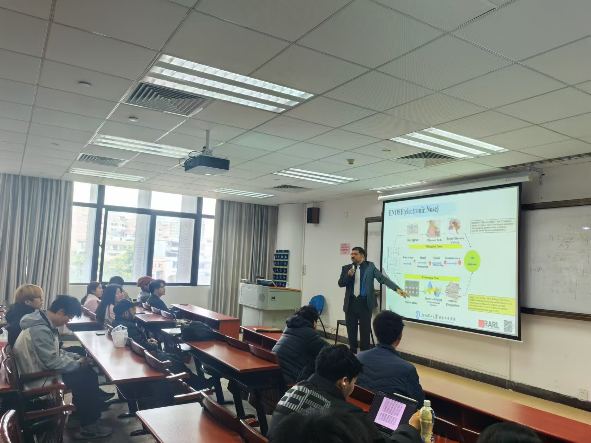
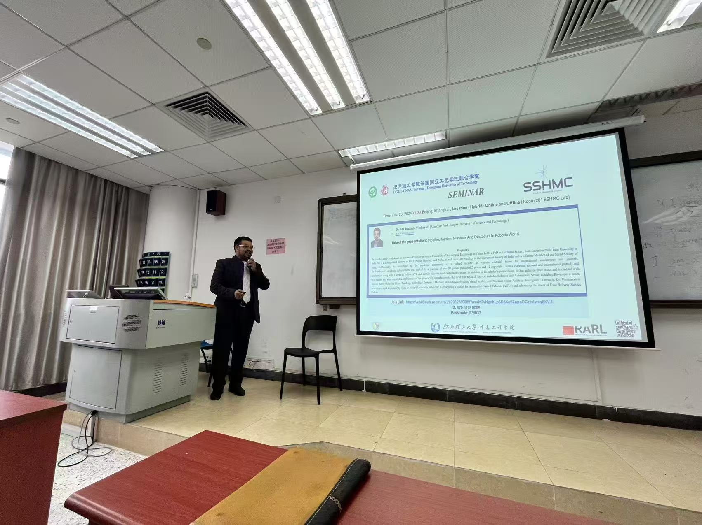
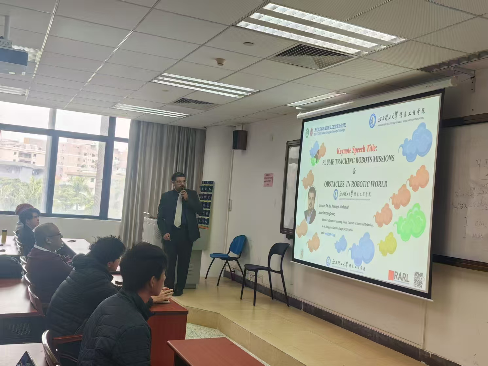

RARL Laboratory at Jiangxi University of Science and Technology, led by Dr. Ata Jahangir Moshayedi, has entered into a strategic collaboration with the Smart Structural Health Monitoring and Control Lab (SSHMC Lab) at Dongguan University, headed by Prof. David Bassir. This partnership aims to advance research and innovation in structural health monitoring and control systems.

